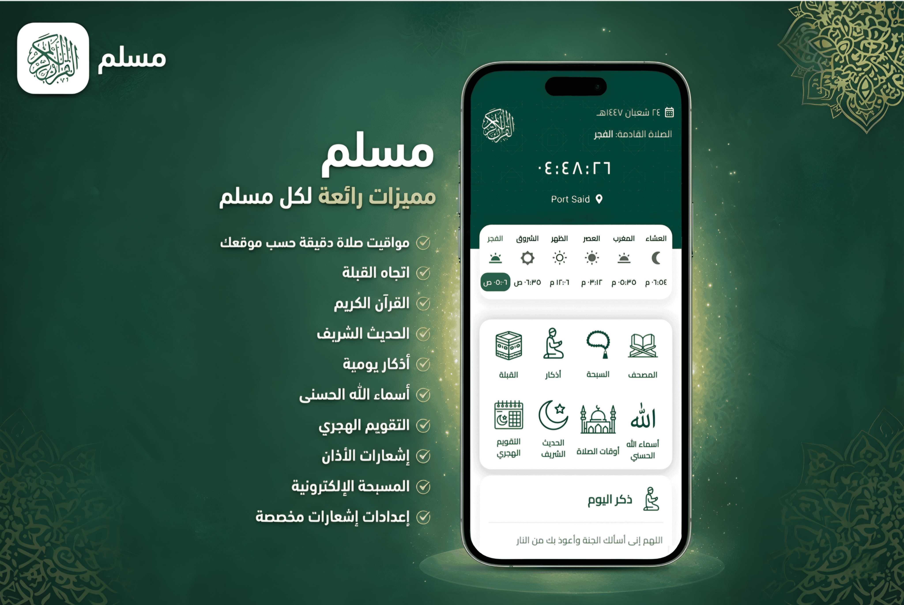

  

<h1 align="center">🕌 Muslim App</h1>

A complete Islamic companion built with Flutter.
 
Fast • Clean • Lightweight • Sadaqah Jariyah 🤍

  
  
  
  

---

## 🚀 Overview

Muslim App is a complete Islamic mobile application built with Flutter, designed to be a daily spiritual companion.

It focuses on:

- ⚡ Performance
- 🧠 Clean Architecture
- 🎨 Beautiful & minimal UI
- 📱 Smooth experience even on low-end devices

---

## 📱 Core Features

### 🕋 Prayer Times
- Accurate location-based prayer times
- Daily updated timings
- Detailed prayer schedule
- Smart error handling

### 🧭 Qibla Direction
- Real-time compass detection
- Smooth directional updates
- Clear loading & error states

### 📖 Quran
- Clean and distraction-free reading screen
- Optimized typography
- Smooth Surah navigation

### 📜 Hadith
- Authentic Hadith collection
- Daily Hadith feature
- Adjustable font size
- Comfortable reading layout

### 🌙 Azkar
- Morning & Evening Azkar
- Categorized sections
- Progress tracking
- Smooth navigation

### 📿 Digital Tasbih
- Counter with goal tracking
- Progress indicator
- Minimal & elegant UI

### 🕌 99 Names of Allah
- Meaning & reflection view
- Beautiful custom UI
- Islamic patterns using Custom Painters

### 📅 Hijri Calendar
- Accurate Hijri date
- Islamic events
- Upcoming events section

### 🔔 Smart Notifications
- Daily Azkar reminder
- Daily Hadith reminder
- Customizable notification settings
- Xiaomi background permission handling

### 🚀 Onboarding Flow
- Welcome screen
- Location permission
- Notification permission
- Smooth first-time experience

---

## 🧠 Architecture

This project follows a scalable Clean Architecture approach.

### 🧩 State Management
- Flutter Bloc / Cubit
- Clear separation of UI & business logic
- Predictable and testable states

### 🎨 UI & Design
- Fully custom UI
- Custom Painters for Islamic patterns
- Responsive layout
- Dark-friendly color palette
- Optimized for all screen sizes

---

## 🛠️ Tech Stack

| Technology | Purpose |
|------------|----------|
| Flutter | Cross-platform framework |
| Dart | Programming language |
| Bloc / Cubit | State management |
| REST APIs | Data sources |
| Geolocator | Location services |
| Awesome Notifications | Local notifications |
| adhan_dart | Prayer times calculations |
| hijri_date | Hijri calendar |
| flutter_qiblah | Qibla direction |
| quran_library | Quran data |

---

## 📦 Installation

bash

git clone https://github.com/20Mahmoud06/muslim.git

cd muslim

flutter pub get

flutter run

🛠️ Requirements

Flutter SDK (latest stable)

Dart SDK

Android Studio / VS Code

Android device or emulator

🌟 Performance Focus

Optimized for low-end devices

Minimal rebuilds

Efficient state handling

Lightweight UI components

Clean and maintainable code

🤝 Contribution

Contributions are welcome 🤍
Feel free to open an issue or submit a pull request.

📄 License

This project is open-source and intended to be a Sadaqah Jariyah.

Use it, improve it, and share the reward 🤲

 Built with sincerity by Mahmoud Safa 🕌 

